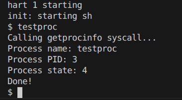
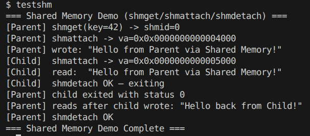
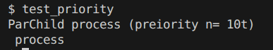
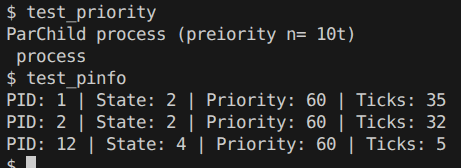
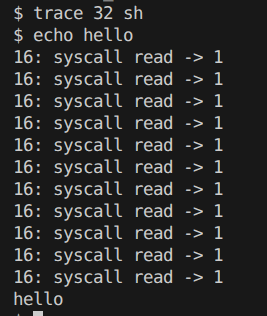
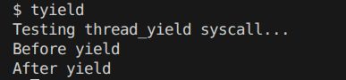
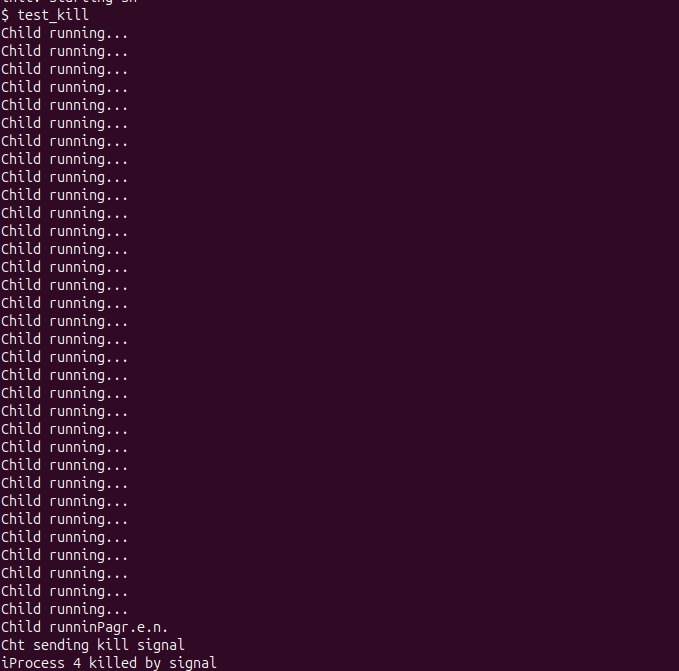
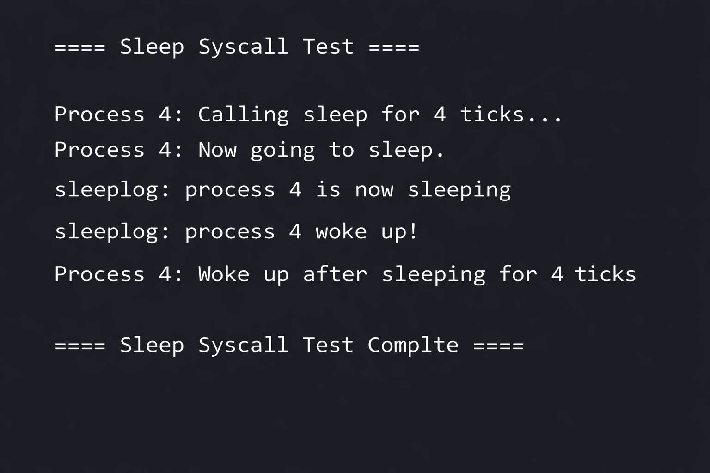

# Team 13 — xv6 Custom System Calls

**Course:** Operating Systems Lab (NSCS210/CSC211)  
**Department:** Computer Science and Engineering  
**Instructor:** Dr. Jaishree Mayank  

## Project Overview

This project extends the **xv6 operating system** (RISC-V version) by implementing custom system calls in the kernel. xv6 is a small, clean Unix-like teaching OS developed at MIT. Each team member implemented one or more system calls end-to-end — from the kernel handler to the user-space test program.

### Key Features

- **`getprocinfo`**: Query and print information about the currently running process directly from the kernel.
- **Shared Memory IPC** (`shmget` / `shmattach` / `shmdetach`): Allow two processes to communicate by sharing the same physical memory page.
- **`fork_with_priority`**: Extend `fork()` to assign a priority value to the newly created child process.
- **`getpinfo`**: Provide a snapshot of all active processes — PID, state, priority, and CPU ticks.
- **Modified `kill` with Signal Support**: Enhance the `kill()` syscall to use signal-based termination instead of direct killing.
- **`trace`**: Monitor and log syscall execution using a bitmask, enabling per-process debugging.
- **`thread_yield`**: Allow a process to voluntarily relinquish the CPU, enabling cooperative multitasking.

---

## Team Members & Individual Contributions

| # | Member | Role | Syscall(s) | Syscall No. |
|---|--------|------|------------|-------------|
| 1 | **Mohammad Salman** | Priority-Based Forking & Process Table Inspection | `fork_with_priority`, `getpinfo` | SYS#26, SYS#27 |
| 2 | **Nandipati Jitendra** | Process Introspection & Shared Memory IPC | `getprocinfo`, `shmget`, `shmattach`, `shmdetach` | SYS#22, 23, 24, 25 |
| 3 | **Neelamber Mishra** | Syscall Tracing with Bitmask | `trace` | SYS#28 |
| 4 | **Narayan Chauhan** | Cooperative CPU Scheduling | `thread_yield` | SYS#29 |
| 5 | **Nithya** | Signal-Based Kill | Modified `kill` | SYS#6 |
| 6 | **Muskan Bhibuthy** | Sleep with Logging | `sleep` (with `sleeplog`) | SYS#30 |

---

## Detailed Member Contributions

### Member 1 — Mohammad Salman (`fork_with_priority` + `getpinfo`)

**Files**: `kernel/proc.h`, `kernel/proc.c`, `kernel/sysproc.c`, `kernel/syscall.h`, `kernel/syscall.c`, `kernel/pstat.h`, `user/user.h`, `user/usys.pl`, `user/test_priority.c`, `user/test_pinfo.c`, `Makefile`

**`fork_with_priority` (SYS#26):**
- Added a `priority` field to `struct proc` (default value: 60).
- Implemented `sys_fork_with_priority()` — calls `sys_fork()` internally and then sets the child's priority to the user-supplied value.
- Demonstrates parent and child running concurrently with different priorities.

**Kernel handler (`kernel/sysproc.c`):**
```c
uint64 sys_fork_with_priority(void) {
  int priority;
  argint(0, &priority);
  int pid = sys_fork();
  if(pid < 0) return -1;
  if(pid == 0) {
    struct proc *p = myproc();
    p->priority = priority;
  }
  return pid;
}
```

**`getpinfo` (SYS#27):**
- Defined a `pstat` structure to hold PID, state, priority, and CPU ticks for all 64 process slots.
- Implemented `sys_getpinfo()` — iterates the kernel process table and copies data to user space using `copyout()`.
- Added a `ticks` field to `struct proc` to track CPU usage per process.

**Data structure (`kernel/pstat.h`):**
```c
#define NPROC 64
struct pstat {
  int pid[NPROC];
  int state[NPROC];
  int priority[NPROC];
  int ticks[NPROC];
  int inuse[NPROC];
};
```

---

### Member 2 — Nandipati Jitendra (`getprocinfo` + Shared Memory IPC)

**Files**: `kernel/sysproc.c`, `kernel/shm.c`, `kernel/defs.h`, `kernel/main.c`, `kernel/syscall.h`, `kernel/syscall.c`, `user/user.h`, `user/usys.pl`, `user/testproc.c`, `user/testshm.c`, `Makefile`

- **`getprocinfo`** — Reads `struct proc` via `myproc()` and prints process name, PID, and state from kernel space.
- **`shmget`** — Allocates one physical page (`kalloc()`) and registers it in a global shared memory table (max 16 segments).
- **`shmattach`** — Maps the shared page into the calling process's virtual address space using `mappages()`.
- **`shmdetach`** — Removes the mapping using `uvmunmap()`; frees physical page (`kfree`) when `refcount` drops to zero.

**Shared memory table (`kernel/shm.c`):**
```c
struct shmseg {
  struct spinlock lock;
  int     state;     // SHM_FREE or SHM_USED
  int     key;       // user-chosen identifier
  uint64  pa;        // physical address of shared page
  int     refcount;  // number of processes attached
};
static struct shmseg shm_table[16];
```

---

### Member 3 — Neelamber Mishra (`trace`)

**Files**: `kernel/proc.h`, `kernel/proc.c`, `kernel/syscall.h`, `kernel/syscall.c`, `kernel/sysproc.c`, `user/user.h`, `user/trace.c`

- Added `trace_mask` to `struct proc`; child processes inherit parent's mask on `fork()`.
- Modified the `syscall()` dispatcher to check `(1 << num) & p->trace_mask` after each syscall and print a trace line if matched.
- Created `user/trace.c` which calls `trace(mask)` then `exec`s the target program.

**Dispatcher logging (`kernel/syscall.c`):**
```c
p->trapframe->a0 = syscalls[num]();
if((1 << num) & p->trace_mask) {
  printf("%d: syscall %s -> %d\n", p->pid, syscall_names[num], p->trapframe->a0);
}
```

---

### Member 4 — Narayan Chauhan (`thread_yield`)

**Files**: `kernel/syscall.h`, `kernel/syscall.c`, `kernel/sysproc.c`, `kernel/defs.h`, `user/user.h`, `user/usys.pl`, `user/tyield.c`, `Makefile`

- Implemented `sys_thread_yield()` — a thin wrapper around `yield()` which sets the current process state to `RUNNABLE` and calls the scheduler.
- Enables cooperative multitasking: a process voluntarily gives up the CPU and resumes when the scheduler picks it again.

**Kernel handler (`kernel/sysproc.c`):**
```c
uint64 sys_thread_yield(void) {
  yield();
  return 0;
}
```

---

### Member 5 — Nithya (Modified `kill` with Signal Support)

**Files**: `kernel/proc.h`, `kernel/proc.c`, `kernel/trap.c`, `user/test_kill.c`, `Makefile`

- Added `signal_pending` and `signal_type` fields to `struct proc`.
- Modified `kkill()` to set `signal_type = 9` (SIGKILL) and `signal_pending = 1` instead of just setting `killed = 1`.
- Added signal handling in `usertrap()` — when `signal_pending` is set, prints a message and calls `kexit(-1)`.

**Modified kill (`kernel/proc.c`):**
```c
p->signal_pending = 1;
p->signal_type = 9;   // SIGKILL
p->killed = 1;
```

**Signal check in trap (`kernel/trap.c`):**
```c
if(p && p->signal_pending) {
  if(p->signal_type == 9) {
    printf("Process %d killed by signal\n", p->pid);
    p->signal_pending = 0;
    kexit(-1);
  }
}
```

---

### Member 6 — Muskan Bhibuthy (`sleep` with `sleeplog`)

**Files**: `kernel/syscall.h`, `kernel/syscall.c`, `kernel/sysproc.c`, `user/user.h`, `user/usys.pl`, `user/test_sleep.c`, `Makefile`

- Enhanced the `sleep` syscall to add kernel-level logging when a process sleeps and wakes up.
- Implemented `sleeplog` functionality — the kernel prints a message when the process enters sleep and again when it wakes up after the specified number of ticks.
- Demonstrates how the OS manages process sleep states and timer-based wakeup events.

**Kernel log in `sysproc.c`:**
```c
uint64 sys_sleep(void) {
  int n;
  argint(0, &n);
  printf("sleeplog: process %d is now sleeping\n", myproc()->pid);
  // ... sleep for n ticks ...
  printf("sleeplog: process %d woke up!\n", myproc()->pid);
  return 0;
}
```

---

## Architecture — System Call Flow in xv6

```
User Program (e.g., test_priority)
        │
        │  calls fork_with_priority(10)
        ↓
user/usys.S  (generated by usys.pl)
        │  li a7, <syscall_number>   ← load syscall number into register
        │  ecall                      ← trap into kernel
        ↓
kernel/trap.c  →  syscall() in kernel/syscall.c
        │  syscalls[num]()           ← dispatch via function pointer table
        ↓
kernel/sysproc.c  (or shm.c)
        │  perform kernel work
        │  read args with argint() / argstr() / argaddr()
        ↓
Return value in a0 register  →  back to user space
```

### Synchronization in Shared Memory
```
Process A (Parent)              Process B (Child)
──────────────────              ─────────────────
shmget(42) → shmid=0            shmget(42) → shmid=0 (existing)
shmattach(0) → va=0x4000        shmattach(0) → va=0x5000
write "Hello" to 0x4000                  │
        │                       read from 0x5000 → "Hello" ✓
        │                       write "Reply" to 0x5000
        │                       shmdetach(0) → refcount: 2→1
wait() returns                           │
read from 0x4000 → "Reply" ✓            │
shmdetach(0) → refcount: 1→0            │
kfree(physical page)                    │
```

---

## Syscall Number Allocation

| Member | Name | Syscall | Number |
|--------|------|---------|--------|
| 2 — Jitendra | `getprocinfo` | Process info | 22 |
| 2 — Jitendra | `shmget` | Create shared segment | 23 |
| 2 — Jitendra | `shmattach` | Map shared segment | 24 |
| 2 — Jitendra | `shmdetach` | Unmap shared segment | 25 |
| 1 — Salman | `fork_with_priority` | Priority fork | 26 |
| 1 — Salman | `getpinfo` | Process table snapshot | 27 |
| 3 — Neelamber Mishra | `trace` | Syscall tracing | 28 |
| 4 — Narayan | `thread_yield` | Cooperative yield | 29 |
| 5 — Nithya | `kill` (modified) | Signal-based kill | 6 |
| 6 — Muskan | `sleep` (with sleeplog) | Sleep with logging | 30 |

---

## How to Build & Run

### Prerequisites

- **OS**: Linux or macOS
- **Emulator**: QEMU (RISC-V, version ≥ 7.2)
- **Compiler**: RISC-V GCC cross-compiler (`riscv64-unknown-elf-gcc`)

### Build & Launch xv6 in QEMU

```bash
make qemu
```

Wait for the boot prompt:
```
xv6 kernel is booting
hart 1 starting
hart 2 starting
init: starting sh
$
```

### Exit QEMU
Press **`Ctrl+A`** then **`X`**

### Clean Build Artifacts
```bash
make clean
```

---

## Execution Output — All Syscalls Tested

### 1. `testproc` — `getprocinfo` (Member 2 — Jitendra, SYS#22)

```text
$ testproc
Calling getprocinfo syscall...
Process name: testproc
Process PID: 3
Process state: 4
Done!
```
> State 4 = RUNNING — process is actively executing when the syscall fires.

---

### 2. `testshm` — Shared Memory IPC (Member 2 — Jitendra, SYS#23/24/25)

```text
$ testshm
=== Shared Memory Demo (shmget/shmattach/shmdetach) ===
[Parent] shmget(key=42) -> shmid=0
[Parent] shmattach -> va=0x0000000000004000
[Parent] wrote: "Hello from Parent via Shared Memory!"
[Child]  shmattach -> va=0x0000000000005000
[Child]  read:  "Hello from Parent via Shared Memory!"
[Child]  shmdetach OK — exiting
[Parent] child exited with status 0
[Parent] reads after child wrote: "Hello back from Child!"
[Parent] shmdetach OK
=== Shared Memory Demo Complete ===
```
> Parent and child map different virtual addresses to the **same physical page** — writes are instantly visible across processes.

---

### 3. `test_priority` — `fork_with_priority` (Member 1 — Salman, SYS#26)

```text
$ test_priority
Parent process
Child process (priority = 10)
```
> Output may appear interleaved due to concurrent execution of parent and child. Child is assigned priority = 10.

---

### 4. `test_pinfo` — `getpinfo` (Member 1 — Salman, SYS#27)

```text
$ test_pinfo
PID: 1 | State: 2 | Priority: 60 | Ticks: 35
PID: 2 | State: 2 | Priority: 60 | Ticks: 32
PID: 12 | State: 4 | Priority: 60 | Ticks: 5
```
> Shows all active processes. State 2 = SLEEPING (init/sh waiting), State 4 = RUNNING (test_pinfo itself).

---

### 5. `trace 32 sh` — Syscall Tracing (Member 3 — Neelamber Mishra, SYS#28)

Bitmask `32 = 1<<5` traces the `read` syscall (syscall number 5).

```text
$ trace 32 sh
$ echo hello
16: syscall read -> 1
16: syscall read -> 1
16: syscall read -> 1
16: syscall read -> 1
16: syscall read -> 1
16: syscall read -> 1
16: syscall read -> 1
16: syscall read -> 1
16: syscall read -> 1
16: syscall read -> 1
16: syscall read -> 1
hello
```
> Every `read` call made by the shell (to read user input char-by-char) is logged with the PID and return value.

---

### 6. `tyield` — `thread_yield` (Member 4 — Narayan, SYS#29)

```text
$ tyield
Testing thread_yield syscall...
Before yield
After yield
```
> Process voluntarily gives up the CPU at `thread_yield()`, scheduler picks another process, then `tyield` resumes and prints "After yield".

---

### 7. Modified `kill` — Signal-Based Termination (Member 5 — Nithya, SYS#6)

```text
$ test_kill
Child running...
Child running...
Parent sending kill signal
Process X killed by signal
```
> Child loops until parent sends signal via `kill(pid)`. Signal type 9 (SIGKILL) is set in the kernel; `usertrap()` catches it and terminates the child with a message.

---

### 8. `sleep` with `sleeplog` — Sleep Syscall (Member 6 — Muskan, SYS#30)

```text
==== Sleep Syscall Test ====

Process 4: Calling sleep for 4 ticks...
Process 4: Now going to sleep.
sleeplog: process 4 is now sleeping
sleeplog: process 4 woke up!
Process 4: Woke up after sleeping for 4 ticks

==== Sleep Syscall Test Complte ====
```
> The kernel logs both the moment a process enters sleep and when it wakes up after the specified number of timer ticks, demonstrating OS-level process state transitions.

---

## Execution Screenshots

### Syscall 1 — `getprocinfo` (Member 2 — Jitendra)


### Syscall 2 — Shared Memory IPC (`shmget` / `shmattach` / `shmdetach`) (Member 2 — Jitendra)


### Syscall 3 — `fork_with_priority` (Member 1 — Salman)


### Syscall 4 — `getpinfo` (Member 1 — Salman)


### Syscall 5 — `trace` (Member 3 — Neelamber Mishra)


### Syscall 6 — `thread_yield` (Member 4 — Narayan)


### Syscall 7 — Modified `kill` with Signal Support (Member 5 — Nithya)


### Syscall 8 — `sleep` with `sleeplog` (Member 6 — Muskan)

