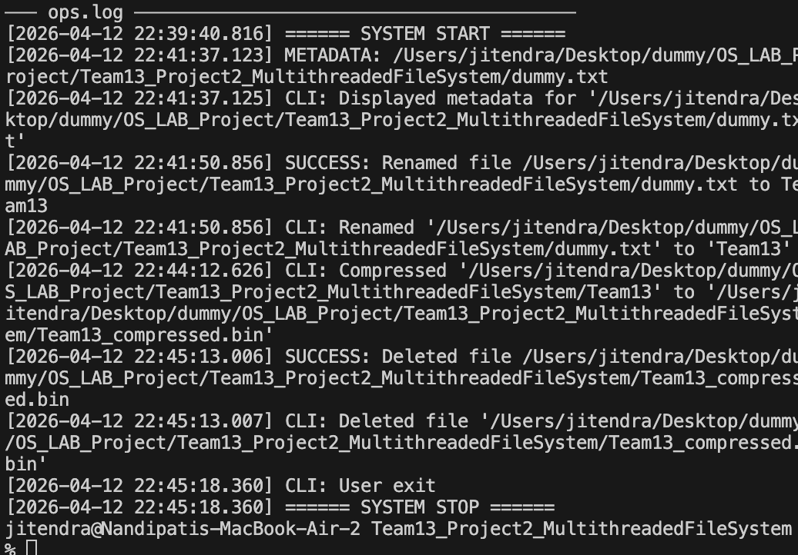

# Team 13 — Multithreaded File Management System

## Project Overview

This project implements a **multithreaded file management system** in C using POSIX threads (`pthreads`). It is a standalone Linux program that provides an interactive CLI for performing file operations such as Deleting, Renaming, Copying, Viewing Metadata, and Compression — each executed with proper synchronization, error handling, and logging.

### Key Features

- **Concurrent File Reading**: Multiple threads can read from the same file simultaneously.
- **Exclusive File Writing**: Ensure that only one thread can write to a file at a time.
- **File Deletion**: Allow users to delete files using dedicated threads.
- **File Renaming**: Implement functionality to rename files safely.
- **File Copying**: Enable copying of files with thread management.
- **File Metadata Display**: Show details like file size, creation date, and permissions.
- **Error Handling**: Robust error handling for all file operations.
- **Logging Operations**: Log actions performed on files for auditing.
- **Compression and Decompression**: Compression and decompression of files.

---

## Team Members & Individual Contributions

| # | Member | Role | Files Owned | Features |
|---|--------|------|-------------|----------|
| 1 | **Mohammad Salman** | Core Architecture, Thread Pool & Synchronization | `main.c`, `thread_pool.c`, `rwlock_manager.c`, `Makefile` | Thread pool execution engine, System initialization, Global read-write lock management |
| 2 | **Nandipati Jitendra** | File I/O & Core Read/Write | `file_rw.c`, `file_ops.c` | Core concurrent read and exclusive write mechanisms, Rename and Delete execution logic |
| 3 | **Neelamber** | CLI & Interactive Menu | `cli.c`, `cli.h` | Setup interactive terminal GUI, Handle user selections, Validations |
| 4 | **Narayan Chauhan** | File Metadata retrieval | `file_meta.c`, `file_meta.h` | Querying POSIX `stat()` to retrieve file sizes, permissions, logic handling for `View Metadata` |
| 5 | **Nithya**| Error Handling & Logging | `logger.c`, `logger.h` | Thread-safe logging, Error tracebacks printed to `ops.log` |
| 6 | **Muskan Bhibuthy** | Compression & Signal Handling | `compress.c`, `signals.c` | Executing zlib/gzip compression algorithms, trapping `SIGINT` |

---

## Detailed Member Contributions

### Member 1 — Mohammad Salman (Architecture, Thread Pool & Synchronization)

**Files**: `main.c`, `thread_pool.c`, `thread_pool.h`, `rwlock_manager.c`, `rwlock_manager.h`, `Makefile`

- **`main.c`** — Orchestrates the entire application. Initializes the signal handlers, logger, prints the project banner, delegates control to the interactive `cli_run()`, and handles the graceful shutdown process `logger_close()`.
- **`thread_pool.c`** — Implements an efficient thread queue using `pthread_mutex_t` and `pthread_cond_t`. Workers sleep until tasks are submitted (`thread_pool_submit`), allowing execution of repetitive file operations without excessive thread-spawning overhead.
- **`rwlock_manager.c`** — Simplifies acquiring POSIX locks (`pthread_rwlock_rdlock` and `pthread_rwlock_wrlock`) to enforce strict reader/writer protocols across the filesystem.

### Member 2 — Nandipati Jitendra (File I/O & Core Rules)

**Files**: `file_rw.c`, `file_ops.c`

- **`file_rw.c`** — Implements fine-grained `pthread_rwlock_t` locking ensuring that multiple readers can retrieve contents simultaneously, but writers maintain absolute exclusivity. 
- **`file_ops.c`** — Ties locks to standard C File I/O abstractions (such as renaming or deleting). Provides wrappers like `delete_file` and `rename_file` that immediately interface with `rwlock_manager()`.

### Member 3 — Neelamber (CLI & Interactive Menu)

**Files**: `cli.c`, `cli.h`

- **`cli_run()`** — An infinite loop presenting an ANSI-colored interactive menu to the user.
- **Input Validation** — Resolves path variations (handling expansions like `~`), checks existence via `access()`, verifies POSIX file permissions (`R_OK`), before sending the job into execution.

### Member 4 — Narayan Chauhan (File Metadata)

**Files**: `file_meta.c`, `file_meta.h`

- **`display_metadata()`** — Invokes `stat()` system calls. Converts opaque UNIX timestamp metadata into readable formats with `ctime()`. Neatly displays byte layouts, and octal permission masks to the user running Option 2.

### Member 5 — Nithya (Error Handling & Logging)

**Files**: `logger.c`, `logger.h`

- **`logger_init()`** / **`log_operation()`** — Uses a `pthread_mutex_t` to ensure only one thread writes to `ops.log` at a time. Creates millisecond-precise timestamps using `gettimeofday()`. Flushes the buffer unconditionally, guaranteeing error traces survive total application crashes.

### Member 6 — Muskan Bhibuthy (Compression & Signal Handling)

**Files**: `compress.c`, `signals.c`

- **`compress_file()`** — Zips standard text or binary files.
- **`setup_signals()`** — Intercepts `SIGINT` (Ctrl+C). Ensures that if the user hard-kills the server, the active streams close, locks release, and temporary memory is fully freed.

---

## Architecture Overview

```
┌────────────────────────────────────────────────────────┐
│                     main.c                             │
│       Init -> Signals -> Logger -> Thread Pool         │
│          Delegates event loop to cli_run()             │
└─────────┬───────────────────────────────┬──────────────┘
          │                               │
          ▼                               ▼
   ┌─────────────┐                 ┌─────────────┐
   │    cli.c    │ ◄─────────────► │ signals.c   │
   │ (Nilambhar) │                 │  (Muskan)   │
   └──────┬──────┘                 └─────────────┘
          │
          ├── Option 1/3: file_ops.c (Jitendra)
          ├── Option 2: file_meta.c (Narayan)
          ├── Option 4: compress.c (Muskan)
          │
          ▼
   ┌─────────────────────────────────────────────────────┐
   │             rwlock_manager.c (Salman)               │
   │      Coordination logic and concurrency scaling     │
   └─────────────────────────────────────────────────────┘
          │
          ▼
   ┌─────────────────────────────────────────────────────┐
   │                 logger.c (Nithya)                   │
   │      Serializes audit trails to ops.log via mutex   │
   └─────────────────────────────────────────────────────┘
```

---


---

## How to Build & Run

### Prerequisites

- **OS**: Linux or macOS
- **Compiler**: GCC with POSIX thread targeting

### Build

```bash
make clean
make
```

### Run

```bash
./fs_sim
```

### Clean
```bash
make clean
```

---

## Execution Output Logs

### 1. Interactive Menu Startup & Delete File Execution
```text
╔════════════════════════════════════════╗
║  Multi-Threaded File Manager (Team 13) ║
╚════════════════════════════════════════╝

Available Operations:
  1. Delete File
  2. View Metadata
  3. Rename File
  4. Compress File
  5. Exit

Choice: 1

--- Delete File ---
Enter file path: data.txt
✓ File 'data.txt' deleted successfully
```

### 2. View Metadata
```text
Choice: 2

--- View Metadata ---
Enter file path: document.pdf
Fetching metadata for 'document.pdf'...
Size: 1048576 bytes
Permissions: -rw-r--r--
Last Accessed: 2026-04-14 10:20:00
Last Modified: 2026-04-14 10:20:05
```

### 3. Rename File
```text
Choice: 3

--- Rename File ---
Enter old file path: report.txt
Enter new file path: final_report.txt
✓ Renamed 'report.txt' → 'final_report.txt'
```

### 4. General Menu Interventions & Options
```text
Choice: 99
ERROR: Invalid choice

Choice: 1
--- Delete File ---
Enter file path: fake_file.txt
ERROR: File 'fake_file.txt' not found
✗ Failed to delete 'fake_file.txt'
```

### 5. Multi-Option Demonstration 
```text
Choice: 4

--- Compress File ---
Enter source file path: archive.tar
Enter destination path: archive.tar.gz
Compressing 'archive.tar' to 'archive.tar.gz'...
✓ File compressed successfully
```

### 6. Expected Final Layout Output
```text
Choice: 5

✓ Goodbye!
====== SYSTEM STOP ======
✓ All resources cleaned up
```

---

## Screenshots



