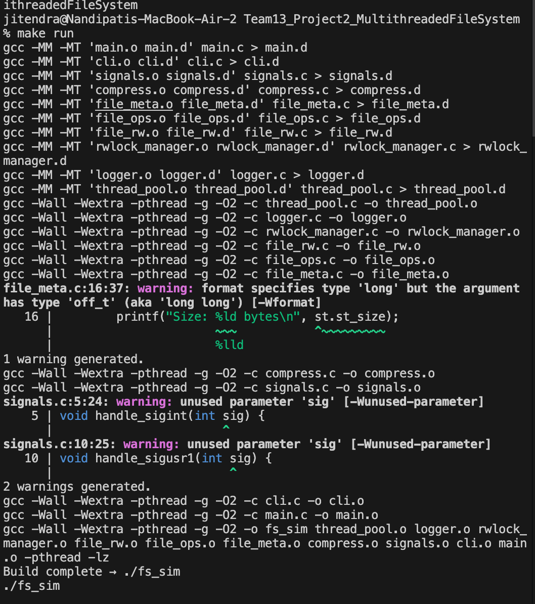
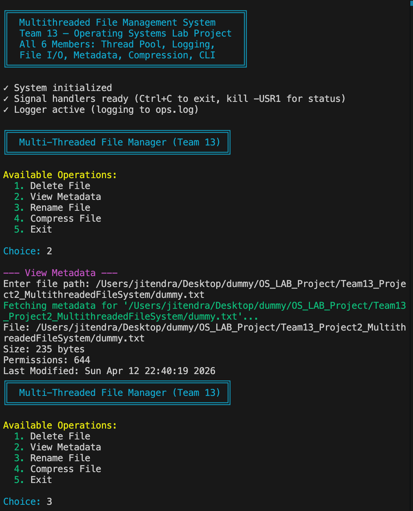
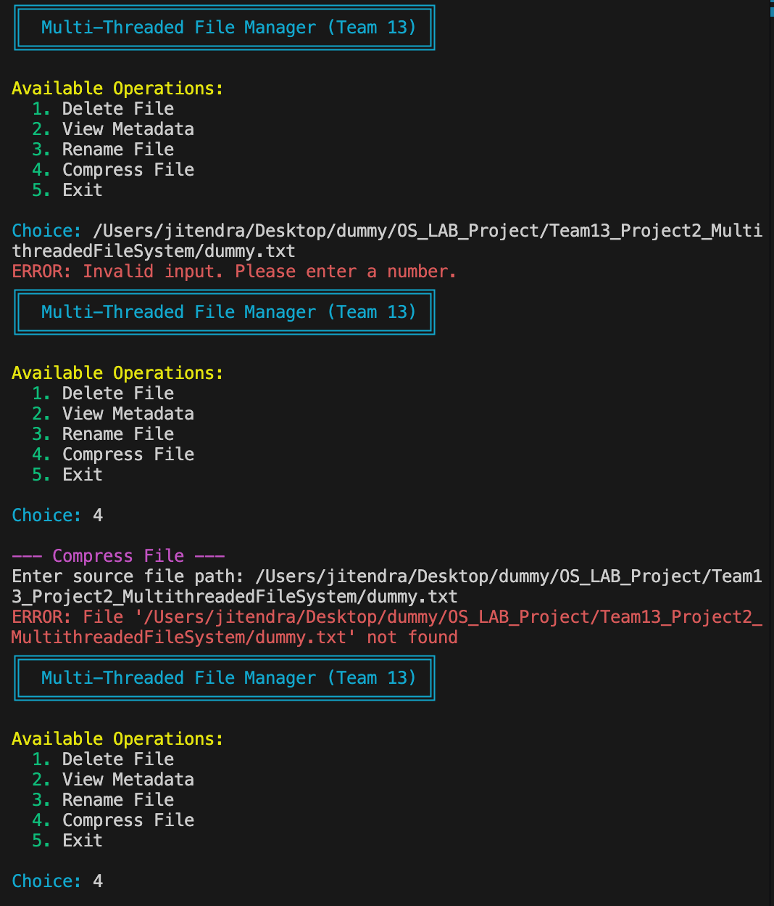
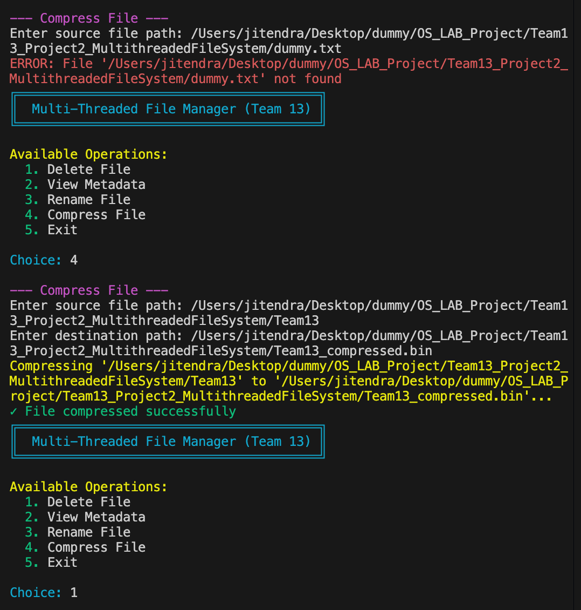
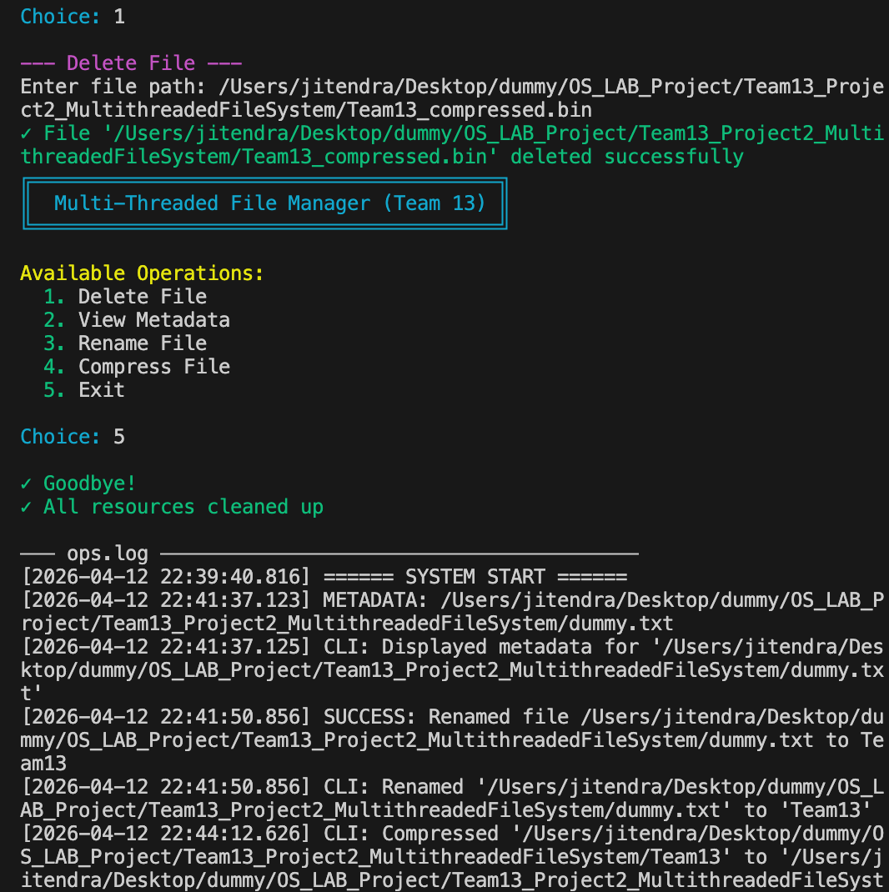

# Execution Output Screenshots

To build and verify the Multithreaded FS Operations, CLI operations, and Logging execution, refer to the screenshots below:

  
   <i>System Compilation and Initialization</i>  

  
   <i>File Metadata Operations</i>  

  
   <i>File Rename Operations</i>  

  
   <i>File Compression Module Working</i>  

  
   <i>File Deletion and Final ops.log Trace</i>  

